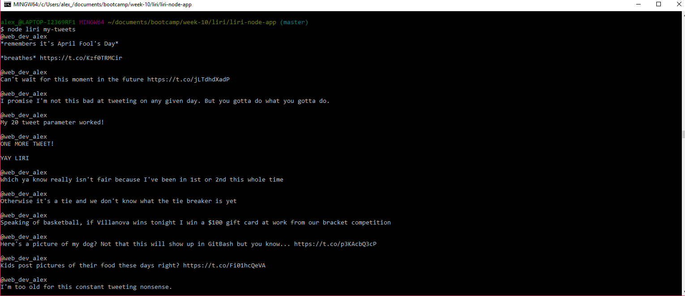
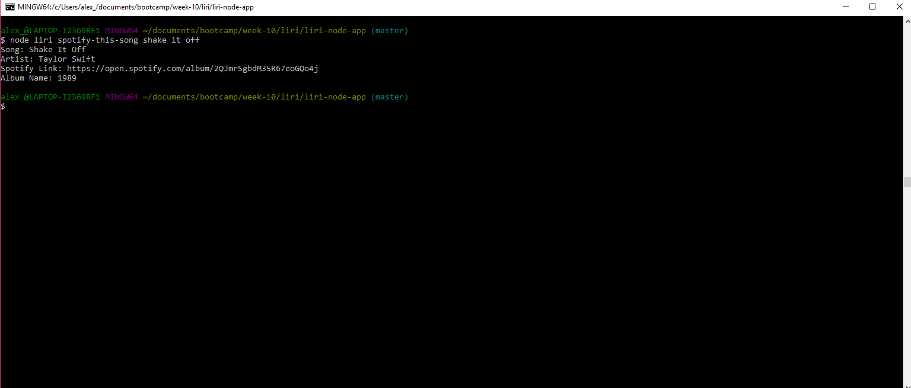
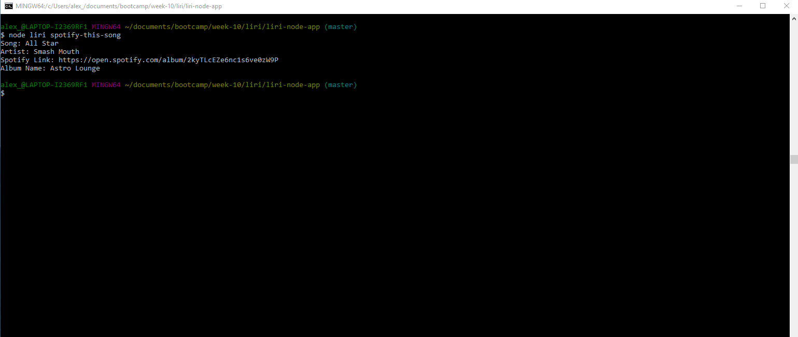
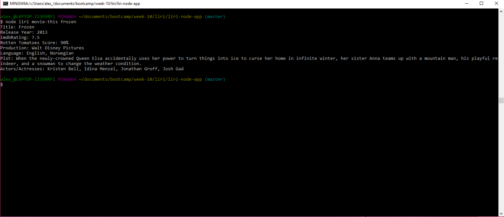
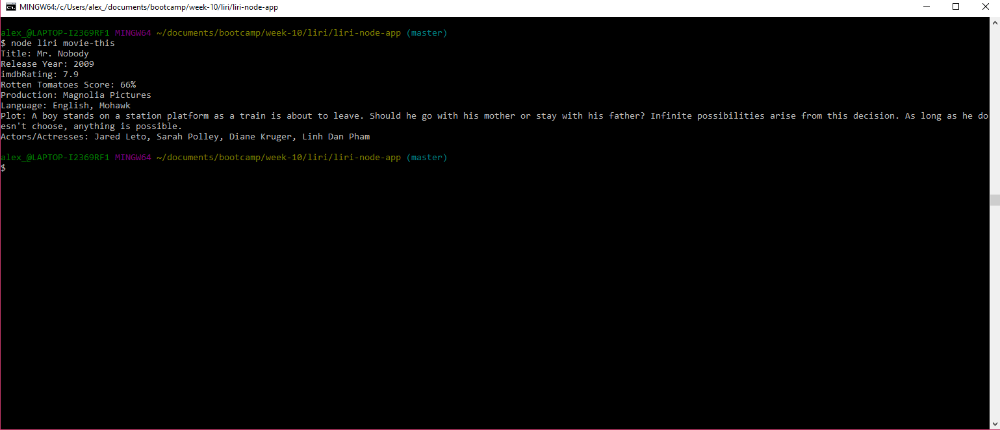
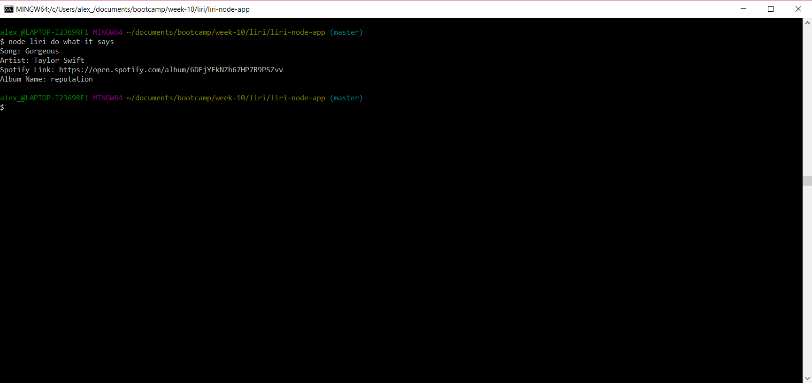
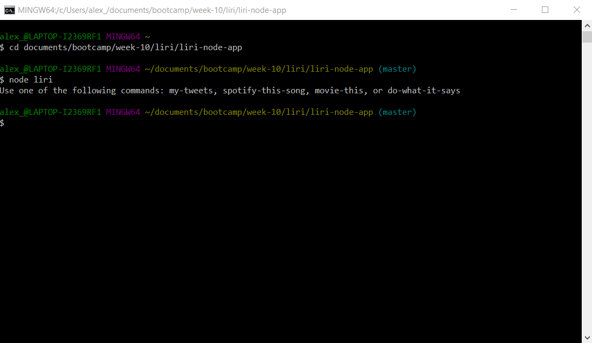

# liri-node-app
This app is used to demonstrate my knowledge of Node.js

## Twitter

When a user uses the command "my-tweets", liri will pull the last 20 tweets from my personal twitter feed. (@web_dev_alex)

## Spotify

When a user uses the the command "spotify-this-song <'song title'>", liri will pull the song's:
* Name
* Artist
* Spotify Link
* Album Name

If no song title is provided, the default song is Smash Mouth's "All Star"

## OMDB

When a user uses the command "movie-this <'movie title'>", liri will pull the movie's:
* Title
* Release Year
* imdbRating
* Rotten Tomatoes Score
* Country in which production took place
* Language
* Plot
* Actors and Actresses

If the user does not provide a movie title, liri will default to providing information for the movie "Mr. Nobody"

## Do What It Says

This command will pull information from Spotify for Taylor Swift's, "Gorgeous" from random.txt

## Commands

If a user provides an invalid command or no command at all, liri will provide a list of valid commands that can be used. 
